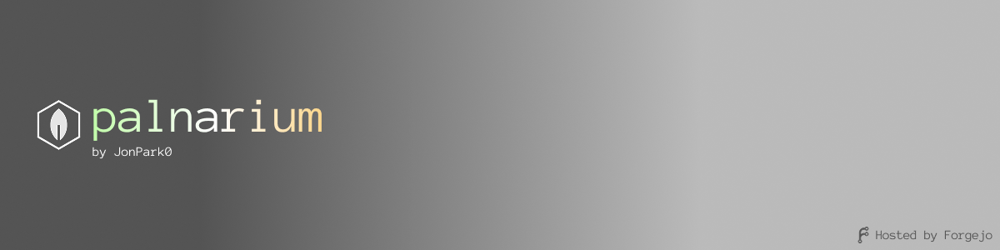

  

 

  
  
  
  
  

 

# Yeochoon Park

**Robotics Engineering** student at Incheon National University, majoring in Mechatronics.  
My work spans across mechanical design, embedded systems, and full-stack web development.

---

### 🚀 Code & Projects

Most of my personal projects and source codes are hosted on my self-hosted Forgejo instance.
Please visit **[git.palnarium.com/jonpark0](https://git.palnarium.com/jonpark0)** to see my work.

- **[palnarium.com](https://palnarium.com)**: My portfolio and playground.
  - [/projects](https://palnarium.com/projects): Detailed descriptions of my engineering projects.
  - [/blog](https://palnarium.com/blog): Technical notes and thoughts.
  - [/gallery](https://palnarium.com/gallery): Photography and renders.

---

### 🛠 Skills & Tools

**Languages**  

**Engineering & Design**  
- **CAD/CAM**: Autodesk Inventor, Fusion 360, Siemens NX, PTC Onshape.
- **3D Printing**: Design for Additive Manufacturing (DfAM), Custom printer builds (Metal/Polymer).
- **Research**: Graph-theory based AM ontology database ([DBpia Link](https://www.dbpia.co.kr/journal/articleDetail?nodeId=NODE10897082)).

**Web & Infrastructure**  
- **Stack**: React (TypeScript), Docker Compose.
- **Self-Hosting**: Home server management, networking, and [Forgejo](https://git.palnarium.com) administration.

---

### 📫 Contact

Reach me via my [Forgejo Profile](https://git.palnarium.com/jonpark0).
